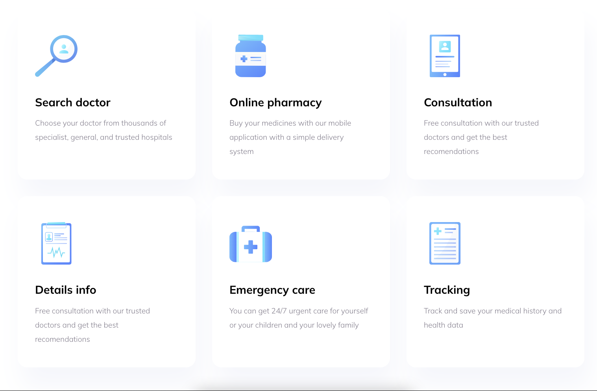
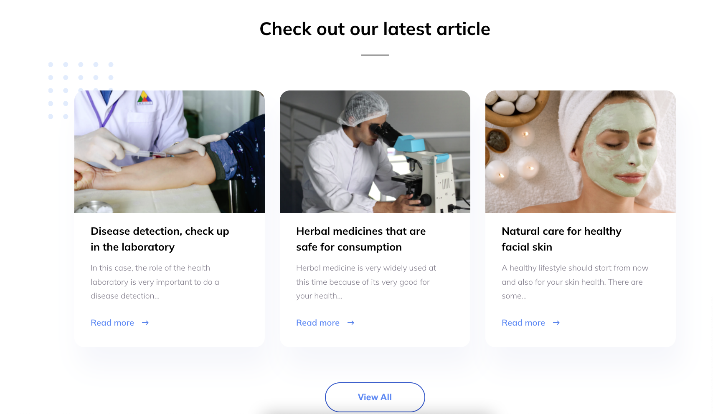
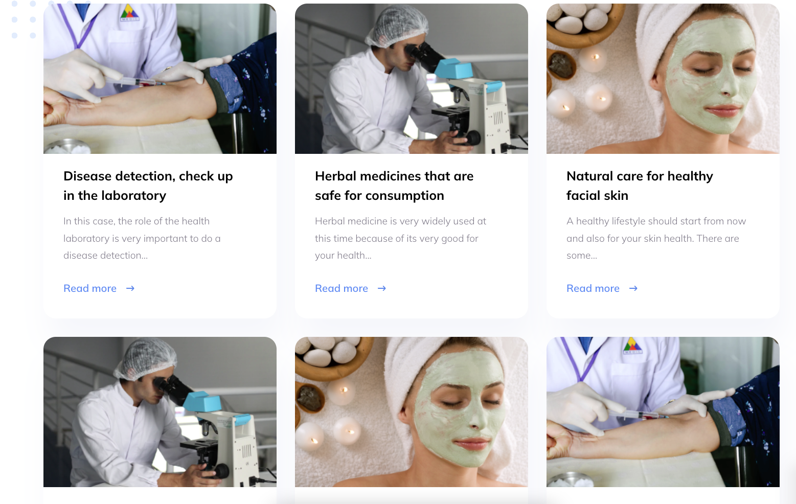
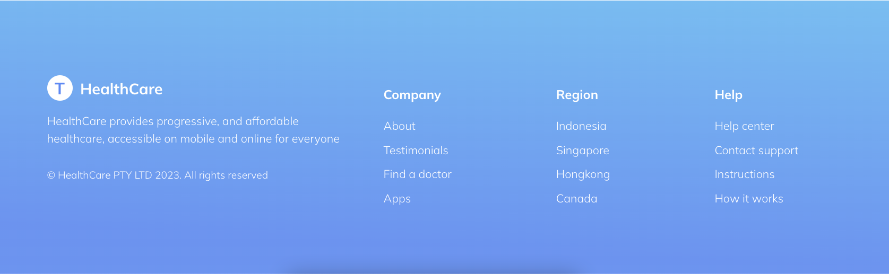

<h1>Virtual Healthcare</h1>

---

Сайт, созданный с помощью библиотеки React.js 
---
Можно обратить внимание на кнопочки и их анимацию заливки. Кнопочки выделены в отдельный компонент.

_Далее приведу скриншоты данного сайта._

<h2>Слайдер</h2>

<h2>Секция со статьями расскрывается и закрывается при нажатии на кнопку</h2>

